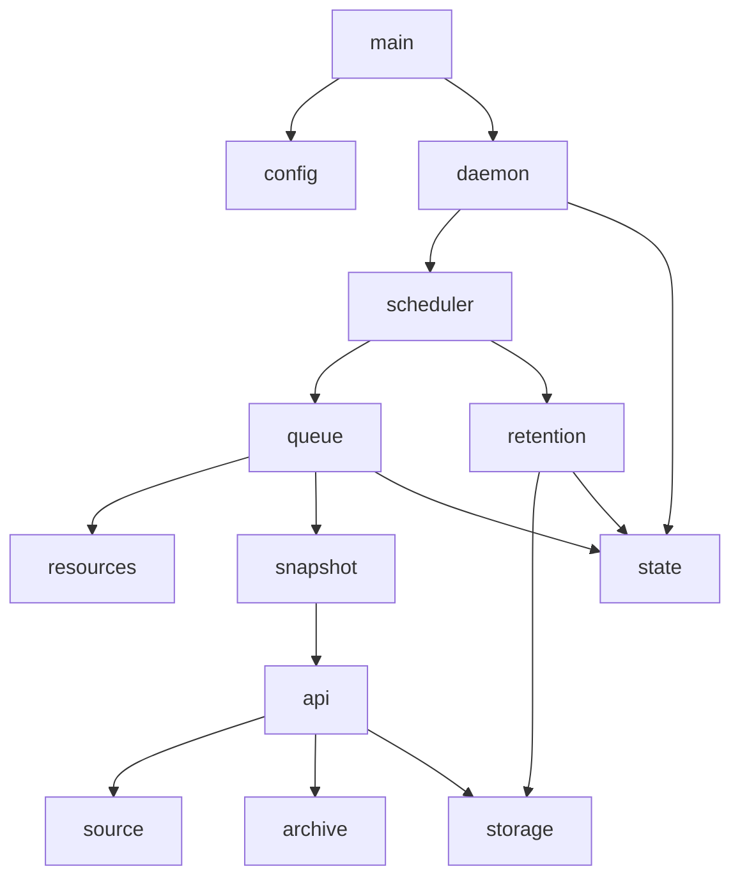

# Architecture

Status: architecture of version 0.0.4. The implementation follows the module
boundaries below; later extensions and current limits are identified explicitly.

## 1. Purpose and scope

`syncthing-backup-tool` is a continuously running Linux service that periodically
archives configured source directories into timestamped ZIP files and retires
older archives according to a separate schedule.

A typical deployment reads Syncthing directories on an SSD and writes archives
to a larger HDD. Sources may be **any readable directories**. The service does
not depend on Syncthing, its API, or its synchronization schedule.

The initial design supports multiple targets, each with its own source,
destination, backup interval, and retention policy. Each archive is a complete,
independent backup of the selected files; restoring it does not require earlier
archives. Configuration refresh is an explicit command, with no automatic file
watching. Incremental backups, a restore command, and filesystem snapshot
providers are later extensions.

Two different queues must be distinguished:

- **Pending jobs:** requests waiting for a worker or a retry. A global capacity
  prevents unbounded work accumulation.
- **Retained snapshots:** completed archives ordered by capture time. Per-target
  limits determine when the oldest archives are removed.

Enqueuing a job records an intention to read the source later. It does not freeze
the source contents at enqueue time.

## 2. Safety invariants

1. Source directories are read-only from the service's perspective. Cleanup can
   only affect service-owned files in configured destinations and state storage.
2. Incomplete or failed archives never count as successful backups. A snapshot
   becomes available only after verification and durable publication.
3. A failed backup never causes deletion of an older snapshot. Retention runs
   independently and must preserve its configured minimum of healthy archives.
4. Only one backup job per target may be queued, retrying, or running. Backup
   publication and retention deletion use the same per-target storage lock.
5. Destination and state directories must not overlap any source. Paths are
   resolved and checked before use, including aliases through symlinks.
6. Missing required source mounts stop capture; missing required destination
   mounts stop writes and cleanup. The service must not back up an underlying
   empty mount directory or write archives to the underlying SSD directory.
7. Work, buffers, and archive metadata have explicit bounds. Insufficient
   resources delay or fail a job rather than cause unlimited allocation.

## 3. Modules

Keep policy in modules that can be tested without starting a daemon. Keep
filesystem operations, clocks, and persistence behind narrow interfaces.

```text
src/
  main.rs          # Command-line entry point
  lib.rs           # Module declarations and application entry points
  api.rs           # Standard module traits and request types
  backends.rs      # Implementation selection and injection
  domain.rs        # Shared identifiers, records, states, and errors
  config.rs        # JSON loading, defaults, and validation
  daemon.rs        # Startup, coordination, and shutdown
  scheduler.rs     # Backup and retention clocks
  queue.rs         # Admission, dispatch, retries, and backpressure
  resources.rs     # Worker and memory reservations
  source.rs        # Directory traversal and source-change detection
  archive.rs       # ZIP tool backend and canonical verification
  snapshot.rs      # Compose one capture through module interfaces
  process.rs       # Supervise rsync/zip/unzip tool process groups
  hooks.rs         # Hook phases, script execution, and durable cleanup recovery
  storage.rs       # Destination checks, publication, and safe removal
  retention.rs     # Selection of expired snapshots
  state.rs         # Durable job journal and snapshot catalog
  telemetry.rs     # Logging and operational status
```

| Module | Responsibility and boundary |
| --- | --- |
| `main` | Parse `--config PATH`, defaulting to `/etc/syncthing-backup-tool/config.json`; expose validation, one-shot backup/retention, immediate trigger/job commands, explicit reload, status, and service-unit generation; invoke the library. |
| `api` / `backends` | Define the standard module contracts and assemble selected implementations. See [modules.md](modules.md) for replacement/injection rules. |
| `snapshot` | Coordinate source inspection, rsync staging, ZIP packing/testing, canonical verification, and durable publication through interfaces. |
| `process` | Spawn tools without a shell, enforce per-process limits, monitor capacity/cancellation, bound diagnostics, and terminate/reap process groups. |
| `hooks` | Execute configured phases through `ScriptRunner`; persist mandatory finally obligations before preparation, and recover failed cleanup without interfering with active jobs. |
| `domain` | Define `Job`, captured `JobSpec`, `Snapshot`, `Manifest`, entry fingerprints, and permanent errors. Identifiers are strings; durable state transitions live in `state`. |
| `config` | Deserialize a versioned `config.json`, apply documented defaults, reject unknown fields, and validate paths, policies, and resource bounds. Return immutable configuration. |
| `daemon` | Own application lifetime: acquire the instance lock, open state, recover interrupted work, start scheduling and dispatch, handle signals, and coordinate shutdown. |
| `scheduler` | Decide when a target is due and when a retention sweep is due. Submit requests without doing compression or deleting files. Accept an injectable clock. |
| `queue` | Classify retry eligibility and compute bounded backoff. The daemon coordinates admission/dispatch through transactional state methods and tracks pending capacity separately from active workers. |
| `resources` | Reserve shared worker slots and application memory for a job. Release reservations on completion, failure, or cancellation. Archive libraries must not create an unbounded internal pool. |
| `source` | Provide a rooted source view and bounded metadata inventory. The rsync backend copies only the explicit selected-file list onto the HDD; the service does not implement file copying. |
| `archive` | Delegate ZIP creation/testing to zip/unzip and perform canonical manifest/SHA-256 verification using an existing ZIP reader. No compression algorithm or retention policy lives here. |
| `storage` | Check mounts and disk space, create exclusive temporary files on the destination filesystem, publish without overwriting, and safely remove owned files. Enforce destination containment. |
| `retention` | Produce an oldest-first deletion plan from healthy, committed catalog records and a target's limits. Ask `storage` to execute it under the target lock. Never infer ownership from a `.zip` extension alone. |
| `state` | Persist scheduling checkpoints, job transitions, snapshot records, and deletion intentions in a versioned SQLite journal/catalog. Provide transactions and startup reconciliation; callers do not issue database queries directly. |
| `telemetry` | Emit structured events and maintain status such as last success, last error, next due time, pending count, and stored bytes. Never hold an unbounded in-memory event history. |

Dependencies flow from the coordinator into policy and then into I/O modules:



`domain` supplies common types throughout. `telemetry` observes operations;
neither owns the control flow. Compression and verification run on bounded
blocking worker threads so they do not stall scheduling or signal handling.
Retention reserves an operation slot and runs separately from the coordinator.

## 4. Records and on-disk layout

A journaled job records unique/target identity, captured settings, attempt count,
state, and next dispatch deadline. A `Snapshot` records job/target/policy identity,
capture start time, archive name, byte size, and SHA-256 digest; catalog columns
track health/deletion. Its internal manifest records capture finish and format version.

Each target's destination is its service-owned archive directory:

```text
/mnt/hdd/backups/photos/
  .snapshot-owner.json
  .partial/<job-id>.zip.part
  .partial/<job-id>.tree/
  .partial/<job-id>.files
  2026-10-08T03-15-00.123456789Z_<job-id>.zip

/var/lib/syncthing-backup-tool/
  instance.lock
  state.sqlite3
```

Archive titles use the **actual capture start time in UTC**, with a unique job
suffix to prevent collisions and overwrites when clocks move backward. Retention
uses recorded capture times with the job ID as a stable tie-breaker, rather than
trusting filesystem modification times or parsing arbitrary filenames.

Inside each ZIP, source-relative paths live under `data/`. The versioned
`meta/manifest.json` records target/job identity, capture times, source metadata,
the effective selection policy, consistency mode, counts, and per-file checksums.
This reserved layout prevents collisions with a source file named
`manifest.json`. The manifest supports inspection and catalog recovery without
the original database. The whole-archive digest lives in the external catalog
because an archive cannot contain its own final digest.

The ownership marker binds a managed directory to its target ID, state directory,
and device identity. Unknown files
remain untouched. An unexpected or missing marker in a nonempty destination
requires explicit adoption in a later administrative workflow; startup must not
silently claim or clean that directory.

## 5. Scheduling and job lifecycle

Backup intervals belong to targets; `retention.sweep_interval_seconds` controls
cleanup independently. These clocks are unrelated to Syncthing activity.

Persist each target's next due time. Use UTC for persisted deadlines and
monotonic waits while running. Re-evaluate deadlines after clock adjustments.
On restart, perform at most one catch-up backup for an overdue target, then
advance its interval past the current time. Do not replay every missed interval.
For a new target, `run_on_startup` chooses immediate capture or a first deadline
one interval after startup; it does not reset established schedules on restart.

The pending capacity counts `Queued` and `RetryWaiting` jobs; running jobs have a
separate concurrency limit. When capacity is full or a target already has an
outstanding job, coalesce/skip that scheduled trigger and log it. Advance its
schedule to avoid a busy loop. Pending jobs are durable and dispatch FIFO, with
due-target admission rotated to prevent a fixed target order causing starvation.

```text
Queued -> Running -> Verifying -> Publishing -> Completed
             |            |           |
             +------------+-----------+-> RetryWaiting -> Queued
                                        -> Failed
```

Publication ambiguity must be reconciled before retrying: an existing archive
with the same job identity may already be a completed result.

For each admitted job:

1. Reserve a worker, bounded memory, and the target's operation lock. Recheck
   source availability, destination mount/identity, and free disk space.
2. Inspect a bounded selected-file inventory, then ask rsync to copy that exact
   list into a private staging tree on the destination filesystem. The SSD needs
   no complete staging copy, and file contents are not collected in RAM.
3. Build the manifest from staged-file checksums, ask zip to create the `.part`
   ZIP, and ask unzip to test it. Canonical verification reads all entries and
   checks manifest counts and SHA-256 checksums. Remove known staging artifacts
   before publication.
4. Flush and synchronize the archive. Persist a publication intention, publish
   with a same-filesystem rename that refuses an existing destination, and
   synchronize both affected directories before marking the snapshot committed.
5. Record success and release resources. A new snapshot becomes eligible for
   retention only after commitment; cleanup happens on its own sweep schedule.

Use ZIP64 for large files or entry counts. Manifest and ZIP directory metadata
must fit a conservative reservation; the current backend retains indexes in RAM
and rejects jobs beyond the allowance. Disk-spooled indexes are a future extension.
A streaming file buffer alone is not a complete memory guarantee.

Transient failures such as unavailable storage or detected source changes use
bounded exponential backoff. `max_attempts` includes the first attempt.
Invalid configuration and unsupported entries are permanent failures for that
job. On terminal failure, release its queue slot and wait for the next scheduled
request. A target failure does not stop healthy targets.

### Source consistency

The initial consistency mode is `live`: files are read over a time interval.
Compare identity, size, and modification metadata before and after reading, and
fail/retry on detected changes, disappearance, or unreadable selected entries.
Do not silently publish a partial backup as successful.

These checks cannot guarantee one coherent point-in-time image of a changing
directory, or application consistency across related files. The manifest must
identify this limitation. A true point-in-time mode requires a stable source
view from a filesystem snapshot or an application that has been quiesced;
`source` is the extension point for that later work. No automatic Syncthing pause
or stop operation is part of this service.

The first implementation handles regular files and directories, including empty
directories. Symlinks are never followed: `reject` fails the job; an explicitly
configured `skip` records them as excluded in the manifest. Special files and
filenames that cannot be represented faithfully cause failure. Preserve file
modification times and Unix permission bits. Ownership, ACLs, extended attributes,
hard-link relationships, and sparse-file layout are outside the initial restore
contract and must not be advertised as preserved.

## 6. Retention and destination capacity

For each sweep, lock the target and select only its healthy, committed snapshots.
Archives keep their original retention policy. Source, destination, target ID,
policy, and captured backend choices identify a cohort; changes create a new cohort for future archives.
Removing/disabling a target or changing its source/destination leaves its old
location unmanaged. Limits below apply independently to each cohort.
Delete oldest first until all enabled limits are satisfied:

- `max_snapshots`: maximum retained archive count.
- `max_age_seconds`: optional maximum age since capture start.
- `max_total_bytes`: optional maximum total committed archive size per target.

`min_snapshots` takes precedence over those limits, preserving at least that many
healthy snapshots when available. If limits cannot be met while honoring the
minimum, report the conflict and leave protected snapshots intact. With fewer
than the minimum available, delete none. Failed or quarantined archives do not
satisfy the minimum; corrupt artifacts are reported and preserved for inspection.
Here, healthy means verified at publication with no subsequently detected damage.
Before a cohort needs deletion, recheck its archive digests and contents, quarantine
damaged archives, and replan against healthy survivors. Continuous checking outside
these sweeps is a separate future feature.

Record deletion intention before unlinking, then synchronize the directory and
update the catalog. If a deletion fails, retain/reconcile its record and retry
on a subsequent sweep. Backup publication and deletion cannot race within a
target. Removing a target from configuration stops management of its archives;
it does not authorize their deletion.

Retention limits are eventually satisfied at sweep time. Count and byte usage
may temporarily exceed them after publication. Storage must accommodate retained
archives **plus an uncompressed staging copy, a new ZIP, and free-space reserve**; never delete
the last good backup merely to make a replacement possible.

`min_free_bytes` is a destination-filesystem reserve. Check it before and during
writing, including temporary metadata, and fail safely if it cannot be
maintained. Since compression ratios and other writers are unpredictable, a
preflight estimate cannot guarantee success. `max_staging_bytes` bounds the
selected payload and is monitored during copying. `max_archive_bytes` provides a hard
per-output limit. Jobs sharing a filesystem must coordinate capacity reservations
and free-space checks even if they belong to different targets.

## 7. Configuration contract

All application policy knobs belong in a versioned `config.json`; CLI arguments
select the file or an administrative mode. The implemented schema is detailed in
[configuration.md](configuration.md), with the following full example:

```json
{
  "config_version": 1,
  "state_dir": "/var/lib/syncthing-backup-tool",
  "shutdown_grace_seconds": 60,
  "queue": {
    "max_pending_jobs": 16,
    "max_attempts": 3,
    "retry_initial_seconds": 30,
    "retry_max_seconds": 900
  },
  "resources": {
    "max_worker_threads": 2,
    "max_concurrent_snapshots": 1,
    "memory_budget_bytes": 268435456,
    "memory_limit_bytes": 536870912,
    "io_buffer_bytes": 1048576
  },
  "retention": {
    "sweep_interval_seconds": 3600
  },
  "logging": {
    "level": "info",
    "format": "json"
  },
  "targets": [
    {
      "id": "photos",
      "enabled": true,
      "source_dir": "/mnt/ssd/syncthing/photos",
      "destination_dir": "/mnt/hdd/backups/photos",
      "required_source_mount": "/mnt/ssd",
      "required_destination_mount": "/mnt/hdd",
      "backup_interval_seconds": 21600,
      "run_on_startup": true,
      "exclude_globs": [".stfolder", ".stversions/**"],
      "symlink_policy": "reject",
      "archive": {
        "compression": "deflate",
        "compression_level": 6,
        "max_archive_bytes": 107374182400,
        "max_entries": 1000000,
        "max_depth": 128
      },
      "storage": {
        "min_free_bytes": 10737418240,
        "max_staging_bytes": 536870912000
      },
      "retention": {
        "min_snapshots": 2,
        "max_snapshots": 30,
        "max_age_seconds": null,
        "max_total_bytes": 1099511627776
      }
    }
  ]
}
```

The example takes a full archive every six hours, sweeps retention hourly, and
keeps up to 30 snapshots within a 1 TiB target limit, subject to the two-snapshot
minimum. The Syncthing exclusions are user-selected examples, not built-in rules.
Exclusion globs match source-relative `/`-separated paths, apply to directory
entries as well as files, and prune matched directory subtrees.

Schema rules:

- Paths are absolute; target IDs are unique and safe as identifiers. Resolve
  existing ancestors when checking paths that do not yet exist. Destination
  directories must not overlap one another, sources, or the state directory.
- Intervals, capacities, attempts, buffers, and enabled byte/count limits are
  positive integers. `null` disables optional age/byte retention limits;
  zero does not mean unlimited. `min_snapshots` is at least one and no greater
  than `max_snapshots`.
- `max_concurrent_snapshots` cannot exceed `max_worker_threads`. Initially a job
  uses one worker for sequential compression and verification; thread limits
  cover backup workers, not the small coordinator/signal infrastructure.
- `memory_budget_bytes` bounds application-managed buffer and metadata
  reservations across jobs, leaving headroom below `memory_limit_bytes` for
  runtime, library, database, and other overhead. Reject jobs/configurations that
  cannot fit their minimum working set. Neither cap means loading whole files
  into memory.
- `memory_limit_bytes` is enforced through the generated systemd unit's
  `MemoryMax=`. That is an OS-enforced service limit, distinct from application
  reservations; exceeding it may terminate work. This behavior follows the
  [systemd resource-control documentation](https://github.com/systemd/systemd/blob/main/man/systemd.resource-control.xml).
  Changing it requires regenerating the unit and restarting the service.
- `compression` initially accepts `store` or `deflate`; validate the level
  against the selected method. Exclusions and symlink policies are recorded in
  each manifest so the meaning of a full backup is explicit.
- `required_source_mount` and `required_destination_mount` may be `null` for
  directories on ordinary filesystems. If set, each expected mount must be
  present and contain its configured directory. Check the source mount before
  capture, and the destination's device identity and ownership marker before
  writes and removals. Pin directory handles while operating to avoid switching
  to an underlying path after a mount change.
- Reject unknown keys, unsupported versions, invalid globs, and contradictory
  limits with field-specific errors. Configuration is loaded at startup and only
  refreshed through an explicit `reload` command over a private Unix socket.
  Validate before swapping the active configuration. Running/queued jobs retain
  target settings; existing archives keep their recorded policies and contents.
  State-directory and hard-memory-cap changes require restart. Never silently
  discard durable jobs when a
  changed queue capacity is smaller than their count: reject that configuration
  with an actionable error.

## 8. Recovery, service lifetime, and observability

Startup takes an exclusive instance lock in `state_dir`; managed target
directories also need ownership/locking checks to prevent two configurations
with different state directories operating on the same archives.

Reconcile the journal and filesystem before scheduling or retention:

- Preserve queued jobs. Interrupted transfers/verifications are not resumable
  captures; remove only identified staging/list/temporary artifacts and retry
  from a new capture attempt within the attempt limit.
- For an interrupted publication, validate the journaled archive's manifest and
  full contents before adopting it. Unindexed archives without an intention remain
  untouched. Resolve the original job before creating another copy.
- Finish or reconcile interrupted deletions. Missing indexed archives produce
  an error and are removed from the healthy count; unknown files remain untouched.
- If state is corrupt or unavailable, disable cleanup and fail startup clearly.
  Catalog reconstruction from verified archives would require an explicit recovery
  operation; automatic reconstruction/adoption is outside version 0.0.1.

Run in the foreground under systemd using a dedicated service user with source
read permissions and destination/state write permissions. The provided service
unit uses an absolute config path, an appropriate restart policy, mount ordering,
and `MemoryMax=` generated from configuration. Its stop timeout must exceed the
configured shutdown grace period. The Debian package installs the account and a
default unit without starting it. `unit` generates an override for custom limits.
Neither requires daemonizing or running backup code as root.

On `SIGTERM` or `SIGINT`, stop admitting jobs and initiating retention. Let
active operations finish within `shutdown_grace_seconds`, then cancel them at
safe I/O boundaries, persist recoverable state, and close storage. Cancellation
before commitment must never expose a successful-looking final archive. A forced
termination or power loss is handled by the same startup recovery rules.

Write structured logs to stdout/stderr for journald. Events include target/job
identity, scheduled and capture times, duration, bytes/files, retry reason,
publication result, and retention deletion reason. Status should expose the last
successful backup and its age per target so a running service that is no longer
creating backups is distinguishable from a healthy one.

## 9. Implementation and validation

The initial release includes the following implementation layers:

1. Domain records, configuration parsing/validation, and a validation
   command against the documented schema.
2. A manually invoked rsync/ZIP backup with destination guards,
   manifest, verification, and safe publication. Exercise it with a normal ZIP
   reader to confirm the archive format and selected metadata.
3. Durable state, ownership locks, and recovery, including crashes between
   verification, rename, and catalog commitment.
4. The bounded queue, worker/memory reservations, scheduling, and retries.
   Deadline arithmetic accepts explicit timestamps for deterministic interval checks.
5. Retention planning and deletion recovery. Check minimum protection,
   failures, unknown files, shared destinations, and count/age/byte conflicts.
6. Signal handling, explicit config refresh, status/logging, systemd unit generation, and deployment
   documentation. Test stop/restart and unavailable source/destination mounts.

Implementation tests should focus on safety boundaries: source mutation,
unreadable files, disk exhaustion, interrupted publication/deletion, resource
exhaustion, and preservation of the last healthy snapshots. No source file's
contents may change as a consequence of any backup or cleanup test.
